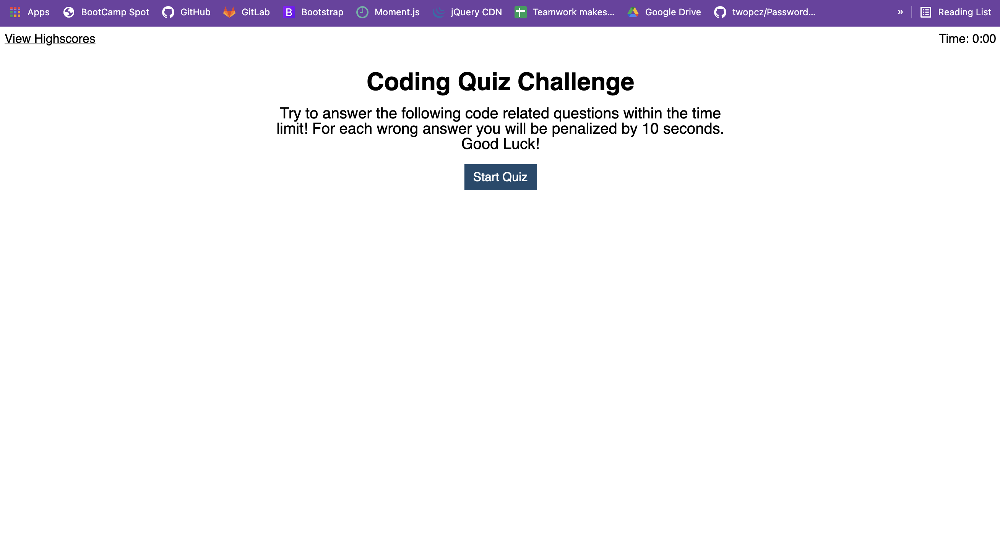
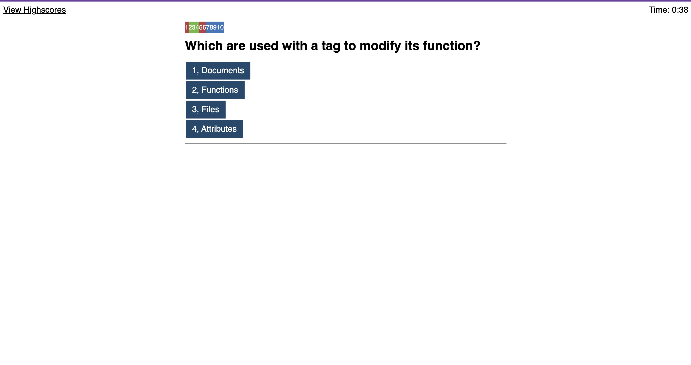
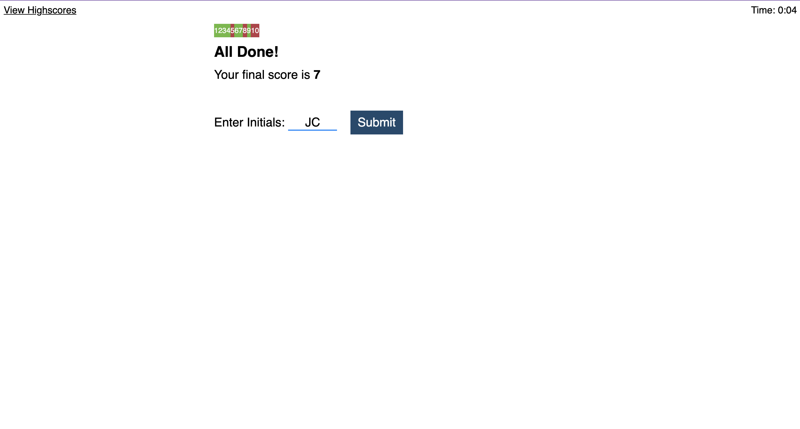
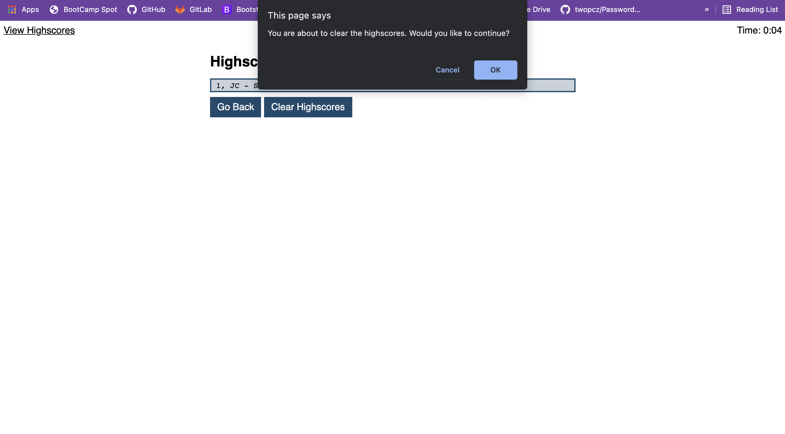
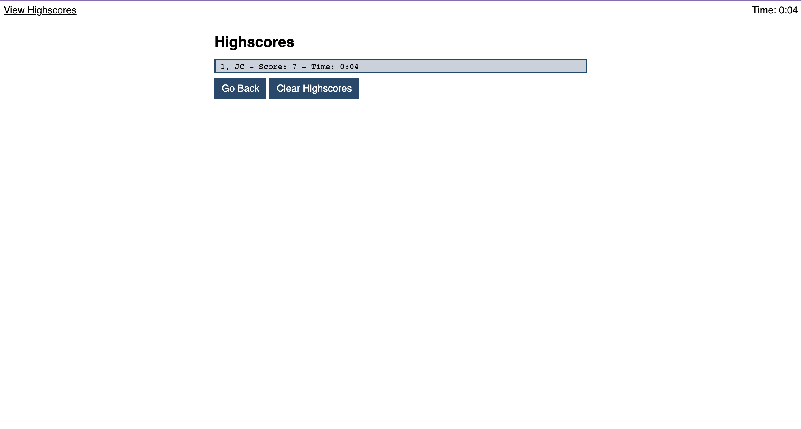

Code Quiz

## User Story

```
AS A coding boot camp student
I WANT to take a timed quiz on JavaScript fundamentals that stores high scores
SO THAT I can gauge my progress compared to my peers
```

## Acceptance Criteria

```
GIVEN I am taking a code quiz
WHEN I click the start button
THEN a timer starts and I am presented with a question
WHEN I answer a question
THEN I am presented with another question
WHEN I answer a question incorrectly
THEN time is subtracted from the clock
WHEN all questions are answered or the timer reaches 0
THEN the game is over
WHEN the game is over
THEN I can save my initials and my score
```

For this assignment I designed and developed a Quiz Game composed of 10 coding related questions and a 1:20s timer. 
This game tracks your correct answers, and your wrong answers, and saves your highscores with your initials! If you 
get a question wrong you will lose 10 seconds! This was a challenge for me and really pushed my knowledge of what I 
know and what I can do. I hope you enjoy it! 

[Coding Quiz]()
[Repository]()







